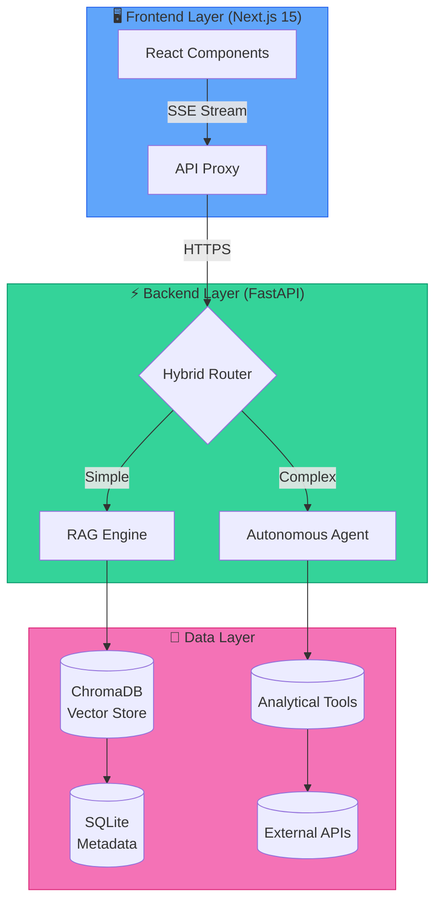

# 🏠 AI Real Estate Assistant

<div align="center">

[](https://opensource.org/licenses/MIT)
[](https://www.python.org/downloads/)
[](https://nodejs.org/)
[](https://fastapi.tiangolo.com/)
[](https://nextjs.org/)
[](https://github.com/astral-sh/ruff)

**Production-Grade AI Platform for Real Estate Agencies**

*Powered by RAG • Multi-LLM Support • Autonomous Agents • Enterprise-Ready*

[🚀 Quick Start](#-quick-start) • [📚 Documentation](#-documentation) • [🏗️ Architecture](#-architecture) • [🔒 Security](#-security) • [📊 Performance](#-performance)

</div>

---

## 📖 Table of Contents

- [Overview](#-overview)
- [Key Features](#-key-features)
- [Live Demo](#-live-demo)
- [Architecture](#-architecture)
- [Tech Stack](#-tech-stack)
- [Quick Start](#-quick-start)
- [Configuration](#-configuration)
- [API Reference](#-api-reference)
- [Deployment](#-deployment)
- [Security](#-security)
- [Performance](#-performance)
- [Testing](#-testing)
- [Roadmap](#-roadmap)
- [Contributing](#-contributing)
- [License](#-license)

---

## 🎯 Overview

The **AI Real Estate Assistant** is an enterprise-grade conversational AI platform that revolutionizes property discovery and real estate analysis. Built on cutting-edge **Retrieval-Augmented Generation (RAG)** technology, it transforms how agencies interact with property data through natural language conversations.

### 💡 What Makes It Different

| Traditional Search | AI Real Estate Assistant |
|-------------------|-------------------------|
| Static filters | Conversational queries |
| Keyword matching | Semantic understanding |
| Manual comparisons | AI-powered analysis |
| Generic results | Personalized recommendations |
| No context memory | Full conversation history |

### 🎓 Use Cases

```
┌─────────────────────────────────────────────────────────────┐
│  🏢 Real Estate Agencies    →  Automate client inquiries    │
│  🏠 Property Portals        →  Enhanced search experience   │
│  💼 Investment Firms        →  Rapid market analysis        │
│  🏗️ Developers              →  Competitive intelligence     │
│  🏘️ Property Managers       →  Tenant query automation      │
└─────────────────────────────────────────────────────────────┘
```

---

## ✨ Key Features

### 🧠 **Intelligent Query Processing**

```python
# Hybrid routing automatically classifies queries
Query: "Show me 3BHK apartments under $500k in Manhattan"
→ RAG Path: Semantic property search

Query: "Analyze ROI for this property vs market average"
→ Agent Path: Multi-step financial analysis
```

- **Intent Classification**: ML-powered query routing
- **Smart Context**: Maintains conversation history
- **Multi-turn Dialogues**: Handles complex, multi-step requests

### 🤖 **Multi-LLM Orchestration**

| Provider | Models | Use Case |
|----------|--------|----------|
| **OpenAI** | GPT-4o, GPT-4 Turbo | Complex reasoning |
| **Anthropic** | Claude 3.5 Sonnet | Long-context analysis |
| **Google** | Gemini 2.0 Flash | Fast responses |
| **Ollama** | Llama 3, Mistral | Local deployment |
| **DeepSeek** | DeepSeek-V3 | Cost-effective |

```python
# Unified interface - switch providers seamlessly
from ai.orchestration import LLMRouter

router = LLMRouter(provider="anthropic")  # or "openai", "google", "ollama"
response = await router.chat(messages)
```

### 🔍 **Advanced RAG Engine**

```
┌────────────────────────────────────────────────────────────┐
│                    Query Processing Pipeline                │
├────────────────────────────────────────────────────────────┤
│  1. Query Analysis      →  Intent classification           │
│  2. Hybrid Retrieval    →  Vector + Keyword search         │
│  3. MMR Reranking       →  Diversity optimization          │
│  4. Context Assembly    →  Smart chunk selection           │
│  5. Response Generation →  LLM with citations              │
└────────────────────────────────────────────────────────────┘
```

- **Vector Store**: ChromaDB with persistent embeddings
- **Hybrid Search**: Semantic + BM25 keyword retrieval
- **MMR Reranking**: Maximal Marginal Relevance for diversity
- **Source Attribution**: Every answer includes citations

### 🛠️ **Autonomous Agent Tools**

```python
tools = {
    "property_search": "Semantic property lookup",
    "mortgage_calculator": "Financial modeling",
    "market_analysis": "Comparative market analysis (CMA)",
    "investment_analyzer": "ROI, cap rate, cash flow",
    "neighborhood_insights": "Schools, crime, amenities",
    "commute_time": "Google Routes API integration",
    "price_history": "Historical trend analysis",
}
```

### 🎨 **Modern User Interface**

<div align="center">


</div>

- **Real-time Streaming**: Server-Sent Events (SSE) for instant responses
- **Interactive Maps**: Property visualization with Leaflet/Mapbox
- **Responsive Design**: Mobile-first, works on all devices
- **Dark Mode**: Built-in theme switching

---

## 🏗️ Architecture

### System Overview



### Directory Structure

```
ai-real-estate-assistant/
├── apps/
│   ├── api/                      # FastAPI Backend
│   │   ├── agents/               # Autonomous AI agents
│   │   │   ├── hybrid_agent.py   # Main orchestrator
│   │   │   ├── query_analyzer.py # Intent classification
│   │   │   └── recommendation_engine.py
│   │   ├── ai/                   # LLM orchestration
│   │   │   ├── providers/        # Multi-provider support
│   │   │   └── router.py         # Intelligent routing
│   │   ├── api/                  # API endpoints
│   │   │   ├── routers/          # Route handlers
│   │   │   ├── middleware/       # CORS, auth, rate limiting
│   │   │   └── deps.py           # Dependency injection
│   │   ├── tools/                # Agent tools
│   │   │   ├── property_tools.py
│   │   │   ├── mortgage_calculator.py
│   │   │   └── market_analysis.py
│   │   ├── vector_store/         # RAG infrastructure
│   │   │   ├── chroma_store.py
│   │   │   ├── hybrid_retriever.py
│   │   │   └── reranker.py
│   │   ├── config/               # Configuration management
│   │   ├── models/               # Pydantic models
│   │   ├── db/                   # Database layer
│   │   └── tests/                # Test suites
│   │
│   └── web/                      # Next.js Frontend
│       ├── src/
│       │   ├── app/              # App router pages
│       │   │   ├── chat/         # Conversational UI
│       │   │   ├── search/       # Property search
│       │   │   ├── analytics/    # Dashboard
│       │   │   └── auth/         # Authentication
│       │   ├── components/       # Reusable UI components
│       │   ├── hooks/            # Custom React hooks
│       │   ├── lib/              # Utilities
│       │   └── contexts/         # React contexts
│       ├── public/               # Static assets
│       └── tests/                # Frontend tests
│
├── deploy/                       # Deployment configurations
│   ├── docker/                   # Dockerfiles
│   ├── k8s/                      # Kubernetes manifests
│   └── vercel/                   # Vercel configuration
│
├── docs/                         # Documentation
│   ├── architecture/             # System design
│   ├── api/                      # API reference
│   ├── security/                 # Security docs
│   └── ADRs/                     # Architecture decisions
│
├── scripts/                      # Automation scripts
│   ├── local/                    # Local development
│   ├── docker/                   # Docker utilities
│   └── deployment/               # CI/CD scripts
│
└── tests/                        # End-to-end tests
    ├── e2e/                      # Playwright tests
    ├── integration/              # API integration
    └── unit/                     # Unit tests
```

---

## 💻 Tech Stack

### Backend

| Technology | Version | Purpose |
|------------|---------|---------|
| **Python** | 3.12+ | Core language |
| **FastAPI** | 0.110+ | API framework |
| **LangChain** | 0.3+ | LLM orchestration |
| **Pydantic** | 2.0+ | Data validation |
| **SQLAlchemy** | 2.0+ | ORM |
| **ChromaDB** | 0.5+ | Vector storage |

### Frontend

| Technology | Version | Purpose |
|------------|---------|---------|
| **TypeScript** | 5.x | Type safety |
| **Next.js** | 15 | React framework |
| **React** | 19 | UI library |
| **Tailwind CSS** | 4.x | Styling |
| **Radix UI** | Latest | Accessible components |
| **Recharts** | 2.15+ | Data visualization |

### Infrastructure

| Technology | Purpose |
|------------|---------|
| **Docker** | Containerization |
| **Kubernetes** | Orchestration |
| **Vercel** | Frontend hosting |
| **Railway/Render** | Backend hosting |
| **GitHub Actions** | CI/CD |

---

## 🚀 Quick Start

### Prerequisites

```bash
# Check versions
python --version    # ≥ 3.12
node --version      # ≥ 20
npm --version       # ≥ 10
```

### 1. Clone Repository

```bash
git clone https://github.com/rouviour-german/AI-Real-Estate-Assistant
cd ai-real-estate-assistant
```

### 2. Configure Environment

```bash
# Copy environment template
cp .env.example .env

# Generate secure API key
openssl rand -hex 32
# Add to .env: API_ACCESS_KEY=your-generated-key
```

### 3. Install Dependencies

#### Backend (Python)

```bash
# Install uv (recommended)
pip install uv

# Create virtual environment
uv venv

# Activate environment
# Windows:
.\.venv\Scripts\activate
# Unix:
source .venv/bin/activate

# Install package
uv pip install -e .[dev]
```

#### Frontend (Node.js)

```bash
cd apps/web
npm install
cd ../..
```

### 4. Run Development Servers

```bash
# Start both backend and frontend
npm run dev

# Or separately:
# Terminal 1 - Backend (port 8000)
npm run dev:api

# Terminal 2 - Frontend (port 3000)
npm run dev:web
```

### 5. Access Application

| Service | URL |
|---------|-----|
| **Frontend** | http://localhost:3000 |
| **Backend API** | http://localhost:8000 |
| **API Docs** | http://localhost:8000/docs |

---

## ⚙️ Configuration

### Environment Variables

```env
# =============================================================================
# LLM PROVIDER API KEYS (Choose at least one)
# =============================================================================
OPENAI_API_KEY=sk-...              # OpenAI (GPT-4o)
ANTHROPIC_API_KEY=sk-ant-...       # Anthropic (Claude 3.5)
GOOGLE_API_KEY=...                 # Google (Gemini)
DEEPSEEK_API_KEY=...               # DeepSeek

# For local models (FREE - No API key required)
DEFAULT_PROVIDER=ollama
OLLAMA_API_BASE=http://localhost:11434

# =============================================================================
# API SECURITY (REQUIRED)
# =============================================================================
API_ACCESS_KEY=your-secure-key-here

# =============================================================================
# DATABASE & STORAGE
# =============================================================================
DATABASE_URL=sqlite+aiosqlite:///./data/app.db
CHROMA_PERSIST_DIR=./vector_store/chroma

# =============================================================================
# OPTIONAL FEATURES
# =============================================================================
# JWT Authentication
AUTH_JWT_ENABLED=true
JWT_SECRET_KEY=your-jwt-secret

# OAuth (Google, Apple)
AUTH_OAUTH_GOOGLE_ENABLED=true
GOOGLE_CLIENT_ID=xxx.apps.googleusercontent.com
GOOGLE_CLIENT_SECRET=GOCSPX-xxx

# Redis (Caching/Sessions)
REDIS_URL=redis://localhost:6379
```

### Provider Selection

```python
# Dynamic provider switching
from config.settings import get_settings

settings = get_settings()

# Auto-fallback chain
provider_priority = ["openai", "anthropic", "google", "ollama"]
active_provider = next((p for p in provider_priority if settings.is_available(p)), "ollama")
```

---

## 📡 API Reference

### Core Endpoints

```yaml
# Property Search
POST /api/v1/search/properties
  Body: { query: "3BHK in Manhattan", filters: {...} }
  Response: { properties: [...], total: 100 }

# Chat Assistant
POST /api/v1/chat/completions
  Body: { message: "Find investment properties", stream: true }
  Response: SSE stream

# RAG Query
POST /api/v1/rag/query
  Body: { question: "What's the average price in SoHo?" }
  Response: { answer: "...", sources: [...] }

# Market Analysis
GET /api/v1/market/trends?city=NYC&period=1y
  Response: { trends: [...], insights: [...] }
```

### Authentication

```bash
# All API requests require API key
curl -X GET http://localhost:8000/api/v1/health \
  -H "X-API-Key: your-api-key"
```

### Interactive Documentation

Access Swagger UI at: http://localhost:8000/docs

---

## 🚢 Deployment

### Docker Deployment

```bash
# Build and run
docker compose -f deploy/compose/docker-compose.yml up --build

# Production mode
docker compose -f deploy/compose/docker-compose.prod.yml up -d
```

### Vercel (Frontend)

```bash
# Install Vercel CLI
npm i -g vercel

# Deploy
cd apps/web
vercel --prod
```

### Railway/Render (Backend)

1. Connect GitHub repository
2. Set environment variables
3. Deploy command: `uvicorn api.main:app --host 0.0.0.0 --port $PORT`

### Kubernetes

```bash
# Apply manifests
kubectl apply -f k8s/namespace.yaml
kubectl apply -f k8s/configmap.yaml
kubectl apply -f k8s/deployment.yaml
kubectl apply -f k8s/service.yaml
```

---

## 🔒 Security

### Authentication & Authorization

```python
# Multi-layer security
┌─────────────────────────────────────────────────────┐
│  🔐 API Key Authentication (Required)               │
│  🎫 JWT Tokens (Optional - User sessions)           │
│  🔑 OAuth 2.0 (Google, Apple sign-in)               │
│  🛡️ RBAC (Role-Based Access Control)                │
│  🚦 Rate Limiting (100 req/min default)             │
└─────────────────────────────────────────────────────┘
```

### Security Features

- ✅ **Secret Scanning**: Pre-commit hooks with Gitleaks
- ✅ **CORS Protection**: Strict origin policies
- ✅ **Input Validation**: Pydantic models
- ✅ **SQL Injection Prevention**: Parameterized queries
- ✅ **XSS Protection**: Content Security Policy headers
- ✅ **CSRF Tokens**: Form protection

### Security Headers

```python
# Automatic security headers
X-Content-Type-Options: nosniff
X-Frame-Options: DENY
X-XSS-Protection: 1; mode=block
Strict-Transport-Security: max-age=31536000
Content-Security-Policy: default-src 'self'
```

---

## 📊 Performance

### Benchmarks

| Metric | Value |
|--------|-------|
| **API Latency (p50)** | < 100ms |
| **API Latency (p99)** | < 500ms |
| **RAG Response Time** | < 2s |
| **Concurrent Users** | 1000+ |
| **Vector Search** | < 50ms |

### Optimization Strategies

```python
# 1. Connection Pooling
DATABASE_URL = "postgresql+asyncpg://...?pool_size=20"

# 2. Response Caching (Redis)
@cache(ttl=300)  # 5 minutes
async def get_property_search(query):
    ...

# 3. Async Operations
async def batch_process_properties(properties):
    tasks = [process(p) for p in properties]
    return await asyncio.gather(*tasks)

# 4. Vector Index Optimization
chroma_client.create_collection(
    name="properties",
    metadata={"hnsw:space": "cosine", "hnsw:construction_ef": 128}
)
```

---

## 🧪 Testing

### Run Test Suites

```bash
# All tests
npm run test

# Backend only
npm run test:api

# Frontend only
npm run test:web

# End-to-end (Playwright)
npm run test:e2e

# With coverage
npm run test:coverage
```

### Test Coverage

```
┌─────────────────────────────────────────────────────┐
│  Backend (pytest)                                   │
│  ├── Unit Tests: 187 files                          │
│  ├── Integration Tests: API, DB                     │
│  └── E2E Tests: Full workflows                      │
├─────────────────────────────────────────────────────┤
│  Frontend (Jest + Playwright)                       │
│  ├── Component Tests                                │
│  ├── Page Tests                                     │
│  └── Visual Regression Tests                        │
└─────────────────────────────────────────────────────┘
```

---

## 🗺️ Roadmap

### Q2 2026

- [ ] Multi-lingual support (Spanish, French, Mandarin)
- [ ] Property data seeding script (500+ samples)
- [ ] Database migrations (Alembic)
- [ ] Error tracking (Sentry integration)
- [ ] Advanced rate limiting

### Q3 2026

- [ ] CRM integrations (Salesforce, HubSpot)
- [ ] Mobile app (React Native)
- [ ] Voice search (Whisper AI)
- [ ] Analytics dashboard
- [ ] Webhook system

### Q4 2026

- [ ] Image analysis (amenity extraction)
- [ ] Market prediction ML models
- [ ] Automated valuation models (AVM)
- [ ] Mortgage pre-approval integration
- [ ] Virtual tours (3D/VR)

---

## 🤝 Contributing

We welcome contributions! Here's how to get started:

### 1. Fork & Clone

```bash
git fork https://github.com/rouviour-german/AI-Real-Estate-Assistant
git clone <your-fork>
```

### 2. Create Feature Branch

```bash
git checkout -b feature/your-amazing-feature
```

### 3. Install Pre-commit Hooks

```bash
pip install pre-commit
pre-commit install
```

### 4. Make Changes & Test

```bash
# Run linters
npm run lint

# Run tests
npm run test

# Ensure all checks pass
```

### 5. Submit Pull Request

1. Commit with conventional commits
2. Push to your fork
3. Create PR on GitHub
4. Wait for CI checks
5. Address review feedback

### Contribution Guidelines

See [docs/development/CONTRIBUTING.md](docs/development/CONTRIBUTING.md) for detailed guidelines.

---

## 📄 License

Distributed under the **MIT License**. See [LICENSE](LICENSE) for details.

```
Copyright (c) 2026 Daniel Lopez

Permission is hereby granted, free of charge, to any person obtaining a copy
of this software and associated documentation files (the "Software"), to deal
in the Software without restriction, including without limitation the rights
to use, copy, modify, merge, publish, distribute, sublicense, and/or sell
copies of the Software...
```

---

## 🙏 Acknowledgments

- **LangChain** - LLM orchestration framework
- **ChromaDB** - Vector database
- **FastAPI** - Modern API framework
- **Next.js** - React framework
- **Radix UI** - Accessible components

---

---

## Author & Contact

- **GitHub:** [@rouviour-german](https://github.com/rouviour-german)
- **Email:** [rouviourgermanmeetings@gmail.com](mailto:rouviourgermanmeetings@gmail.com)
- **Profile:** https://github.com/rouviour-german

